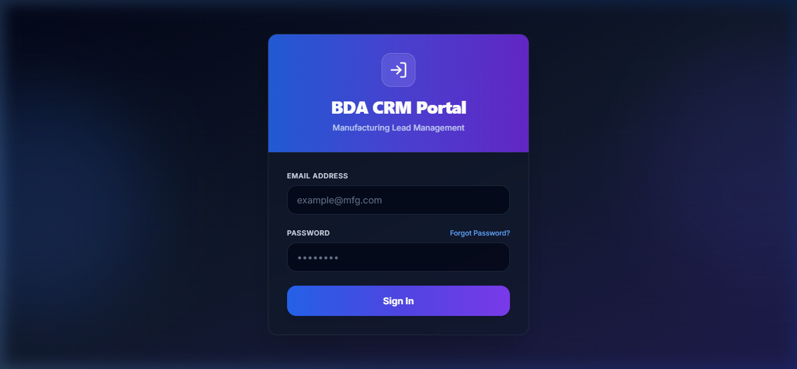
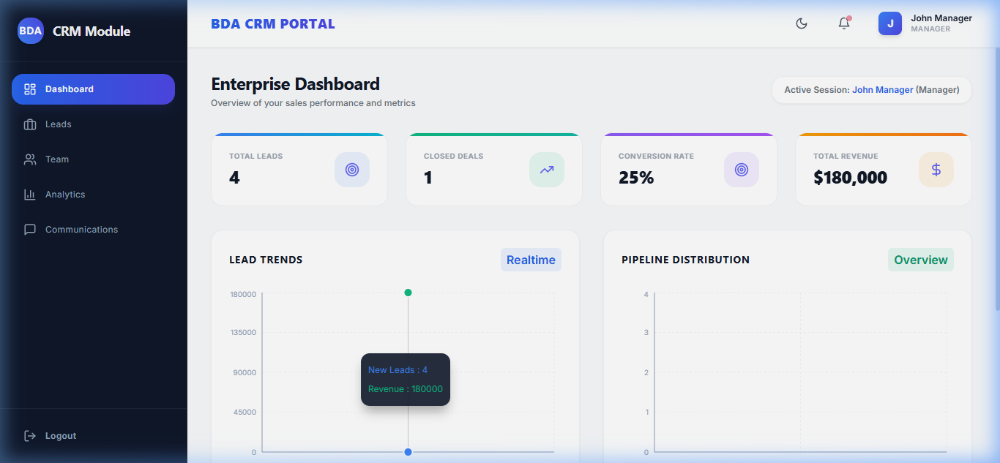
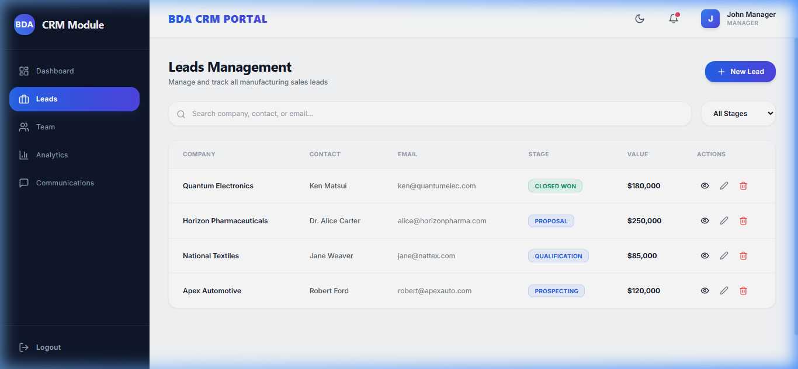
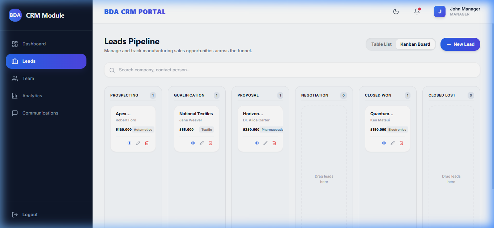
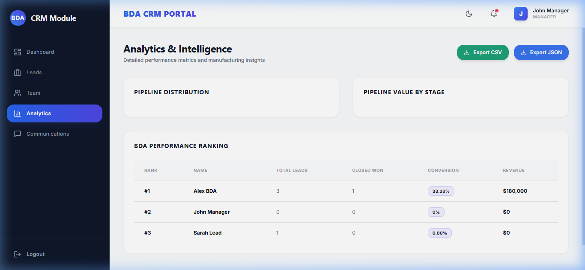

# BDA Team Module — Manufacturing CRM Portal

<div align="center">

[](https://bda-team-module.vercel.app/)
[](https://bda-team-module-82s1.onrender.com)
[](https://github.com/PJain7988/BDA_Team_Module)
[](LICENSE)

**A production-ready, full-stack MERN application for manufacturing BDA teams to manage leads, track performance, and collaborate efficiently.**

[🌐 Open Live App](https://bda-team-module.vercel.app/) &nbsp;|&nbsp; [📡 API Health Check](https://bda-team-module-82s1.onrender.com/api/health) &nbsp;|&nbsp; [📂 GitHub Repository](https://github.com/PJain7988/BDA_Team_Module)

</div>

---

## 🔗 Live Deployment Links

| Service | URL | Status |
|---------|-----|--------|
| **Frontend** (Vercel) | https://bda-team-module.vercel.app/ | [](https://bda-team-module.vercel.app/) |
| **Backend API** (Render) | https://bda-team-module-82s1.onrender.com | [](https://bda-team-module-82s1.onrender.com/api/health) |
| **API Health Check** | https://bda-team-module-82s1.onrender.com/api/health | [](https://bda-team-module-82s1.onrender.com/api/health) |

> ⚠️ **Note:** The Render backend may take 30–60 seconds to wake up on the first request (free tier cold start). Please wait briefly and then try logging in.

---

## 🔐 Demo Credentials

> Ready-to-use accounts **auto-seeded** into the database on first start.

| # | Role | Email | Password | Name | Access Level |
|---|------|-------|----------|------|--------------|
| 1 | 👑 **Manager** | `manager@mfg.com` | `Manager@123` | John Manager | Full system access — all features |
| 2 | 👨‍💼 **Team Lead** | `teamlead@mfg.com` | `TeamLead@123` | Sarah Lead | Team Alpha — analytics, assign, reports |
| 3 | 👨‍💼 **Team Lead 2** | `teamlead2@mfg.com` | `TeamLead2@123` | Raj Sharma | Team Beta — analytics, assign, reports |
| 4 | 📋 **BDA** | `bda@mfg.com` | `BDA@123` | Alex BDA | Team Alpha — own leads + communications |
| 5 | 📋 **BDA 2** | `bda2@mfg.com` | `BDA2@123` | Priya Patel | Team Alpha — own leads + communications |
| 6 | 📋 **BDA 3** | `bda3@mfg.com` | `BDA3@123` | Mohit Singh | Team Beta — own leads + communications |

> 💡 **Tip:** Click the **Quick Demo Login** role cards on the login page to auto-fill any of these credentials instantly!

### 🏢 Demo Teams
| Team | Team Lead | Members | Region | Revenue Target |
|------|-----------|---------|--------|----------------|
| **Sales Alpha** | Sarah Lead | Alex BDA, Priya Patel | North America | $500,000 |
| **Sales Beta** | Raj Sharma | Mohit Singh | South Asia | $350,000 |

### 📋 Pre-Seeded Sample Data
- **8 Leads** across all pipeline stages (Prospecting → Closed Won/Lost)
- **5 Communication logs** (Email, Call, Meeting types)
- **2 Teams** with distinct leads and members

---

## 📸 Screenshots

### 🔐 Login Page — with Quick Demo Login


> Features: Glassmorphism card, animated blobs, role-based quick-fill buttons, password show/toggle.

---

### 📊 Dashboard — Real-Time KPI Overview


> Features: 4 KPI stat cards, 6-month line trend chart, pipeline bar chart, and dark/light mode support.

---

### 📋 Lead Management — Advanced Table & Filters


> Features: CRUD operations, stage badges, pagination, search & filter by status/value/team member.

---

### 🗂️ Kanban Board — Drag-and-Drop Pipeline


> Features: Drag leads across 5 pipeline stages with real-time Socket.io updates.

---

### 📈 Analytics — Business Intelligence & Rankings


> Features: Revenue charts, conversion rates, team performance leaderboard, individual BDA KPIs.

---

## 🎯 Project Overview

The BDA Team Module is a comprehensive **workflow management CRM** built for manufacturing companies. It streamlines:
- Lead pipeline management across multiple stages
- Team performance monitoring with real-time analytics
- Client communication and follow-up tracking
- Role-based access control for BDA, Team Lead, and Manager levels
- Real-time notifications via Socket.io

---

## 🛠️ Tech Stack

### Frontend
| Technology | Purpose |
|-----------|---------|
| **React 18** | Component UI library |
| **Redux Toolkit** | Global state management |
| **React Router v6** | Client-side routing |
| **Tailwind CSS v3** | Utility-first styling |
| **Recharts** | Data visualization charts |
| **React Beautiful DnD** | Kanban drag-and-drop |
| **React Toastify** | Toast notifications |
| **Axios** | HTTP client with interceptors |
| **Socket.io Client** | Real-time updates |
| **Lucide React** | Modern icon library |
| **Vite** | Lightning-fast build tool |

### Backend
| Technology | Purpose |
|-----------|---------|
| **Node.js** | JavaScript runtime |
| **Express.js** | Web framework |
| **MongoDB Atlas** | Cloud NoSQL database |
| **Mongoose** | MongoDB ODM |
| **JWT** | Token-based authentication |
| **Bcryptjs** | Password hashing |
| **Socket.io** | Real-time WebSocket communication |
| **Helmet** | HTTP security headers |
| **Express Rate Limit** | API abuse protection |
| **Morgan** | HTTP request logger |
| **Compression** | Response gzip compression |

### Deployment
| Platform | Service |
|---------|---------|
| **Vercel** | Frontend hosting (CI/CD via GitHub) |
| **Render** | Backend hosting (auto-deploy) |
| **MongoDB Atlas** | Cloud database (M0 free tier) |

---

## 📁 Project Structure

```
bda-team-module/
├── frontend/                    # React + Vite frontend
│   ├── public/
│   ├── src/
│   │   ├── components/
│   │   │   ├── Navbar.jsx       # Top navigation with notifications
│   │   │   ├── Sidebar.jsx      # Collapsible navigation sidebar
│   │   │   ├── Modal.jsx        # Reusable modal dialog
│   │   │   ├── LoadingSpinner.jsx
│   │   │   ├── Notification.jsx # Socket.io notifications
│   │   │   └── PrivateRoute.jsx
│   │   ├── pages/
│   │   │   ├── Login.jsx        # Auth with demo quick-fill
│   │   │   ├── Dashboard.jsx    # KPIs, trends, charts
│   │   │   ├── Leads.jsx        # Lead table + Kanban board
│   │   │   ├── LeadDetail.jsx   # Lead detail & communications
│   │   │   ├── Team.jsx         # Team members & performance
│   │   │   ├── Analytics.jsx    # Deep business intelligence
│   │   │   ├── Communications.jsx
│   │   │   └── Profile.jsx
│   │   ├── redux/
│   │   │   ├── slices/
│   │   │   └── store.js
│   │   ├── services/
│   │   │   ├── api.js           # Axios instance with interceptors
│   │   │   └── authService.js
│   │   ├── App.jsx
│   │   └── index.css            # Tailwind + design system
│   ├── index.html               # SEO-optimized entry point
│   ├── vite.config.js
│   └── package.json
│
├── backend/                     # Node.js + Express API
│   ├── config/
│   │   └── database.js          # MongoDB connection + memory fallback
│   ├── controllers/
│   │   ├── authController.js
│   │   ├── leadController.js
│   │   ├── teamController.js
│   │   ├── communicationController.js
│   │   └── analyticsController.js
│   ├── middleware/
│   │   ├── auth.js              # JWT verification + role check
│   │   ├── errorHandler.js      # Centralized error handling
│   │   └── validation.js        # Request validation
│   ├── models/
│   │   ├── User.js
│   │   ├── Lead.js
│   │   ├── Communication.js
│   │   └── Team.js
│   ├── routes/
│   │   ├── auth.js
│   │   ├── leads.js
│   │   ├── team.js
│   │   ├── communications.js
│   │   └── analytics.js
│   ├── utils/
│   │   └── seeder.js            # Auto database seeding
│   ├── server.js                # Express app entry point
│   └── package.json
│
├── api/
│   └── index.js                 # Vercel serverless entry
├── screenshots/                 # README screenshots
├── .gitignore
├── vercel.json                  # Vercel deployment config
├── render.yaml                  # Render deployment config
└── README.md
```

---

## 🚀 Getting Started

### Prerequisites
- Node.js v16+
- MongoDB (local) or MongoDB Atlas URI
- npm or yarn

### 1. Clone the Repository
```bash
git clone https://github.com/PJain7988/BDA_Team_Module.git
cd BDA_Team_Module
```

### 2. Backend Setup
```bash
cd backend
npm install

# Create environment file
cp .env.example .env
# Edit .env with your MongoDB URI and JWT secret
```

**Backend `.env` example:**
```env
MONGODB_URI=mongodb+srv://<user>:<password>@cluster0.xxxx.mongodb.net/BDA_Team_Module
JWT_SECRET=your_super_secret_jwt_key_here
JWT_EXPIRE=7d
PORT=5000
NODE_ENV=development
CORS_ORIGIN=http://localhost:3000
```

```bash
# Start backend
npm run dev
# Server: http://localhost:5000
```

### 3. Frontend Setup
```bash
cd ../frontend
npm install

# Create environment file
cp .env.example .env
```

**Frontend `.env` example:**
```env
VITE_API_URL=http://localhost:5000
VITE_WS_URL=http://localhost:5000
VITE_ENV=development
```

```bash
# Start frontend
npm run dev
# App: http://localhost:3000
```

---

## 🧪 Complete API Reference

**Base URL (Production):** `https://bda-team-module-82s1.onrender.com`

### 🔓 Public Routes — No Authentication Required

| Method | Endpoint | Description |
|--------|----------|-------------|
| `GET` | `/` | API info, version, all endpoint links |
| `GET` | `/api/health` | Health check — uptime, env, node version |
| `POST` | `/api/auth/login` | Login user |
| `POST` | `/api/auth/register` | Register new user |
| `POST` | `/api/auth/forgot-password` | Request password reset |

**Login body:**
```json
{ "email": "manager@mfg.com", "password": "Manager@123" }
```
**Login response:**
```json
{ "token": "<jwt>", "user": { "_id", "name", "email", "role", "team" } }
```

---

### 🔐 Auth Routes — Bearer Token Required

| Method | Endpoint | Auth | Description |
|--------|----------|------|-------------|
| `GET` | `/api/auth/me` | ✅ All | Get current user profile |
| `PUT` | `/api/auth/update-profile` | ✅ All | Update name, phone, department |
| `PUT` | `/api/auth/change-password` | ✅ All | Change password |
| `POST` | `/api/auth/logout` | ✅ All | Server-side logout |

---

### 📋 Leads

| Method | Endpoint | Auth | Description |
|--------|----------|------|-------------|
| `GET` | `/api/leads` | ✅ All | Get leads (role-filtered) |
| `GET` | `/api/leads/:id` | ✅ All | Get single lead with comms |
| `POST` | `/api/leads` | ✅ All | Create new lead |
| `PUT` | `/api/leads/:id` | ✅ All | Update lead |
| `PATCH` | `/api/leads/:id/stage` | ✅ All | Update pipeline stage only |
| `POST` | `/api/leads/:id/assign` | 👨‍💼 TL + Mgr | Assign lead to user |
| `DELETE` | `/api/leads/:id` | 👑 Manager | Delete lead |

**GET /api/leads — Query Params:**
```
?stage=Prospecting&assignedTo=<userId>&industry=Automotive
&page=1&limit=20&search=Apex
```
**Stage values:** `Prospecting` `Qualification` `Proposal` `Negotiation` `Closed Won` `Closed Lost`

**POST /api/leads — Body:**
```json
{
  "companyName": "Apex Automotive",
  "contactName": "Robert Ford",
  "email": "robert@apexauto.com",
  "phone": "8005550199",
  "industry": "Automotive",
  "dealValue": 120000,
  "stage": "Prospecting",
  "source": "Website",
  "assignedTo": "<userId>",
  "expectedCloseDate": "2026-08-01",
  "probability": 20,
  "notes": "Interested in bulk supply."
}
```

---

### 👥 Team

| Method | Endpoint | Auth | Description |
|--------|----------|------|-------------|
| `GET` | `/api/team` | ✅ All | Get all teams |
| `POST` | `/api/team` | 👑 Manager | Create team |
| `PUT` | `/api/team/:id` | 👑 Manager | Update team |
| `DELETE` | `/api/team/:id` | 👑 Manager | Delete team |
| `GET` | `/api/team/members` | ✅ All | Get all members |
| `GET` | `/api/team/members/:id` | ✅ All | Get member with stats |
| `POST` | `/api/team/members` | 👑 Manager | Add new member |
| `PUT` | `/api/team/members/:id` | 👑 Manager | Update member |
| `DELETE` | `/api/team/members/:id` | 👑 Manager | Remove member |

---

### 💬 Communications

| Method | Endpoint | Auth | Description |
|--------|----------|------|-------------|
| `GET` | `/api/communications` | ✅ All | Get all comm logs (role-filtered) |
| `GET` | `/api/communications/:leadId` | ✅ All | Get all logs for a lead |
| `POST` | `/api/communications` | ✅ All | Log new communication |
| `PUT` | `/api/communications/:id` | ✅ All | Update communication |
| `DELETE` | `/api/communications/:id` | ✅ All | Delete communication |

**POST /api/communications — Body:**
```json
{
  "lead": "<leadId>",
  "type": "Call",
  "subject": "Requirement Discussion",
  "description": "Discussed pricing and shipping terms.",
  "communicatedWith": "Robert Ford",
  "duration": 25,
  "nextFollowUp": "2026-07-10"
}
```
**Type values:** `Call` `Email` `Meeting` `Note` `Demo`

---

### 📈 Analytics

| Method | Endpoint | Auth | Description |
|--------|----------|------|-------------|
| `GET` | `/api/analytics/dashboard` | ✅ All | KPIs — leads, revenue, conversion |
| `GET` | `/api/analytics/trends` | ✅ All | Monthly trends (`?months=6`) |
| `GET` | `/api/analytics/team-performance` | 👨‍💼 TL + Mgr | Per-member KPI breakdown |
| `GET` | `/api/analytics/pipeline` | ✅ All | Stage-wise lead counts & values |
| `GET` | `/api/analytics/export` | 👨‍💼 TL + Mgr | Export data as JSON |

**Dashboard response:**
```json
{
  "metrics": {
    "totalLeads": 8,
    "closedDeals": 1,
    "conversionRate": 12.5,
    "totalRevenue": 180000,
    "pipelineValue": 1305000
  }
}
```

### ⚡ Quick Test with curl

```bash
# 1. Health check
curl https://bda-team-module-82s1.onrender.com/api/health

# 2. Login as Manager & save token
TOKEN=$(curl -s -X POST https://bda-team-module-82s1.onrender.com/api/auth/login \
  -H "Content-Type: application/json" \
  -d '{"email":"manager@mfg.com","password":"Manager@123"}' | jq -r '.token')

# 3. Get all leads
curl https://bda-team-module-82s1.onrender.com/api/leads \
  -H "Authorization: Bearer $TOKEN"

# 4. Get dashboard metrics
curl https://bda-team-module-82s1.onrender.com/api/analytics/dashboard \
  -H "Authorization: Bearer $TOKEN"

# 5. Create a lead
curl -X POST https://bda-team-module-82s1.onrender.com/api/leads \
  -H "Content-Type: application/json" \
  -H "Authorization: Bearer $TOKEN" \
  -d '{"companyName":"Test Corp","contactName":"John Doe","dealValue":50000,"stage":"Prospecting"}'
```

---

## 🔒 Role-Based Access Control

| Feature | BDA | Team Lead | Manager |
|---------|:---:|:---------:|:-------:|
| View Own Leads | ✅ | ✅ | ✅ |
| Create Leads | ✅ | ✅ | ✅ |
| Edit Own Leads | ✅ | ✅ | ✅ |
| View Team Leads | ❌ | ✅ | ✅ |
| Assign Leads | ❌ | ✅ | ✅ |
| View Analytics | ❌ | ✅ | ✅ |
| Manage Team | ❌ | ❌ | ✅ |
| Delete Leads | ❌ | ❌ | ✅ |
| Generate Reports | ❌ | ✅ | ✅ |

---

## 🗄️ Database Schema

<details>
<summary><strong>User Schema</strong></summary>

```javascript
{
  name:       String (required),
  email:      String (unique, required),
  password:   String (bcrypt hashed),
  role:       'BDA' | 'TeamLead' | 'Manager',
  team:       ObjectId → Team,
  phone:      String,
  department: String,
  avatar:     String,
  createdAt:  Date,
  updatedAt:  Date
}
```
</details>

<details>
<summary><strong>Lead Schema</strong></summary>

```javascript
{
  companyName:      String (required),
  contactName:      String (required),
  email:            String,
  phone:            String,
  industry:         String,
  dealValue:        Number,
  stage:            'Prospecting' | 'Qualification' | 'Proposal' | 'Negotiation' | 'Closed Won' | 'Closed Lost',
  source:           String,
  assignedTo:       ObjectId → User,
  expectedCloseDate:Date,
  probability:      Number (0–100),
  notes:            String,
  communications:   [ObjectId → Communication],
  createdBy:        ObjectId → User,
  createdAt:        Date,
  updatedAt:        Date
}
```
</details>

<details>
<summary><strong>Communication Schema</strong></summary>

```javascript
{
  lead:            ObjectId → Lead,
  type:            'Call' | 'Email' | 'Meeting' | 'Note' | 'Demo',
  subject:         String,
  description:     String,
  communicatedWith:String,
  duration:        Number (minutes),
  nextFollowUp:    Date,
  createdBy:       ObjectId → User,
  createdAt:       Date
}
```
</details>

---

## 📈 Performance Features

- **Redux caching** — reduces redundant API calls
- **Lazy loading** — routes loaded on demand
- **Debounced search** — prevents excessive API hits
- **Pagination** — lead list supports 20 items per page
- **Gzip compression** — backend responses compressed
- **Rate limiting** — 500 global / 20 auth requests per 15 min
- **In-memory MongoDB fallback** — works even without Atlas URI

---

## 🐛 Troubleshooting

### Backend cold start (Render free tier)
The backend may take **30–60 seconds** on first request. Simply wait and retry.

### CORS errors
Make sure `CORS_ORIGIN` in backend `.env` matches the frontend URL exactly.

### MongoDB connection
If `MONGODB_URI` is not set, the backend automatically uses an **in-memory MongoDB** (data resets on restart). Set a real Atlas URI for persistence.

### Port conflicts
```bash
# Change PORT in backend .env
PORT=5001
```

---

## 🤝 Git Workflow

```bash
git clone https://github.com/PJain7988/BDA_Team_Module.git
cd BDA_Team_Module

# Make changes
git add .
git commit -m "feat: your feature description"
git push origin main
```

---

## 📄 License

This project is open source and available under the [MIT License](LICENSE).

---

## 👨‍💻 Author

**Prateek Jain** — Full-stack MERN Developer

Built as a technical assessment project demonstrating production-grade full-stack development with React, Node.js, MongoDB, and real-time WebSocket capabilities.

---

## 📞 Support & Links

| Resource | Link |
|----------|------|
| 🌐 Live App | https://bda-team-module.vercel.app/ |
| 📡 Backend API | https://bda-team-module-82s1.onrender.com |
| 💊 API Health | https://bda-team-module-82s1.onrender.com/api/health |
| 📦 GitHub | https://github.com/PJain7988/BDA_Team_Module |

---

<div align="center">

**Last Updated:** July 2026 &nbsp;·&nbsp; **Version:** 1.0.0 &nbsp;·&nbsp; **Status:** 🟢 Production Ready

</div>
